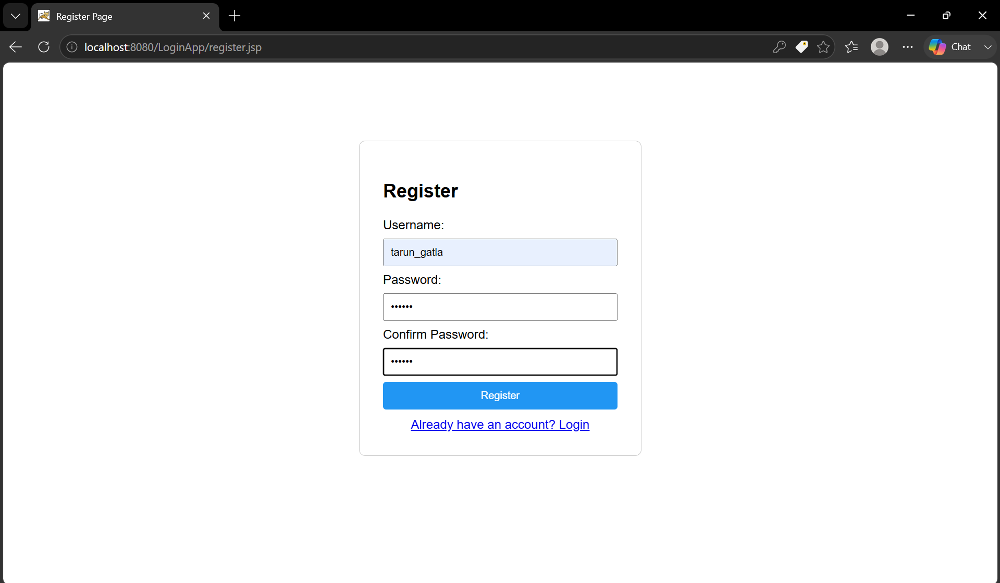
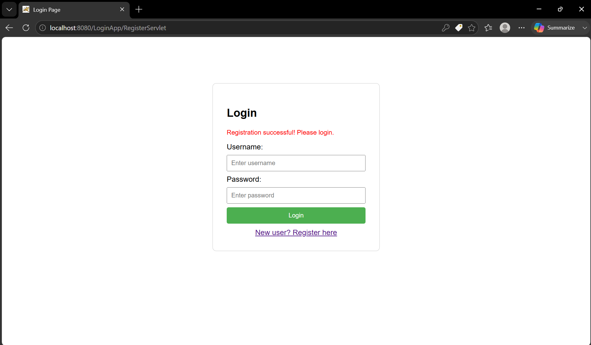
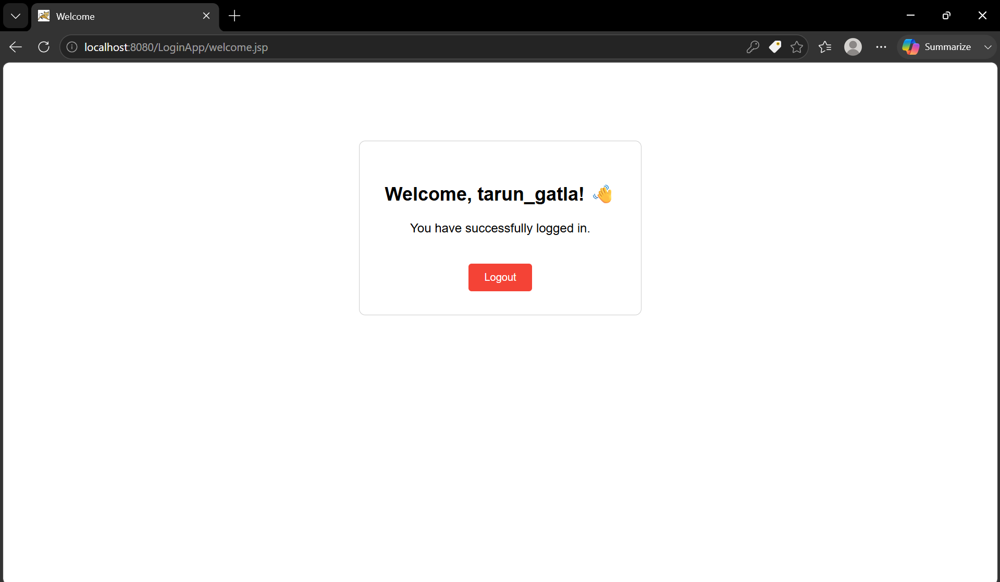

A simple full-stack web application built with **Java Servlets**, **JSP**, and **JavaScript**, deployed on **Apache Tomcat**. This project demonstrates client-server integration including user registration, login, session management, and form validation.

---

## 📋 Table of Contents

- [Features](#features)
- [Tech Stack](#tech-stack)
- [Project Structure](#project-structure)
- [Prerequisites](#prerequisites)
- [Usage](#usage)
- [Screenshots](#screenshots)

---

## ✨ Features

- ✅ User **Registration** with username & password
- ✅ User **Login** with session management
- ✅ **Welcome page** showing logged-in username
- ✅ **Logout** functionality that destroys the session
- ✅ Error message on **incorrect password**
- ✅ **JavaScript form validation** on client side


---

## 🛠 Tech Stack

| Layer        | Technology              |
|--------------|-------------------------|
| Frontend     | JSP, HTML, CSS, JavaScript |
| Backend      | Java Servlets (javax.servlet) |
| Server       | Apache Tomcat 9.x       |
| Language     | Java 17                 |

---

## 📁 Project Structure

```
LoginApp/
├── src/
│   └── com/app/
│       ├── LoginServlet.java       # Handles login logic
│       ├── RegisterServlet.java    # Handles user registration
│       └── LogoutServlet.java      # Handles session invalidation
│
├── assets/
│   ├── REGISTER.png                # Screenshot - Register page
│   ├── SUCCESS.png                 # Screenshot - Registration success
│   └── WELCOME.png                 # Screenshot - Welcome page
│
└── WebContent/
    ├── login.jsp                   # Login form page
    ├── register.jsp                # Registration form page
    ├── welcome.jsp                 # Welcome page (session protected)
    ├── validate.js                 # JavaScript client-side validation
    └── WEB-INF/
        ├── web.xml                 # Servlet mappings
        └── classes/
            └── com/app/
                ├── LoginServlet.class
                ├── RegisterServlet.class
                └── LogoutServlet.class
```

---

## ✅ Prerequisites

Make sure you have the following installed:

- [Java JDK 17+](https://www.oracle.com/java/technologies/downloads/)
- [Apache Tomcat 9.x](https://tomcat.apache.org/download-90.cgi)

Set the following **Environment Variables**:

| Variable       | Value                              |
|----------------|------------------------------------|
| `JAVA_HOME`    | `C:\Program Files\Java\jdk-17`     |
| `CATALINA_HOME`| `C:\tomcat9`                       |
| `PATH`         | Add `C:\tomcat9\bin`               |

---

---

## 📖 Usage

1. Open the app at `http://localhost:8080/LoginApp/login.jsp`
2. If you are a new user, click **"Register here"** to create an account
3. After registering, log in with your credentials
4. On successful login, you will be redirected to the **Welcome page**
5. Click **Logout** to end your session and return to the login page
6. If you enter incorrect credentials, an error message will be displayed

---

## 🔒 JavaScript Validations

The following validations are performed **client-side** before form submission:

**Login Form:**
- Username cannot be empty
- Password cannot be empty
- Password must be at least 6 characters

**Registration Form:**
- Username cannot be empty
- Username must be at least 3 characters
- Password must be at least 6 characters
- Confirm password must match password

---


## 📸 Screenshots

### 1. Register Page
> New users can sign up with a username, password, and confirmation password.



---

### 2. Registration Successful
> After successful registration, the user is redirected to the login page with a success message.



---

### 3. Welcome Page
> After a successful login, the user is greeted by name with a logout button.



---


